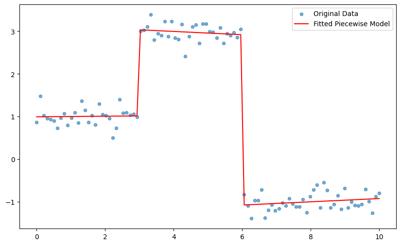

# GOLF — Gradient Optimized piecewise Linear Fitting

plf is a small Python package built with JAX and Equinox for fitting continuous piecewise-linear functions (splines) to 1D data. It provides a differentiable model representing a continuous piecewise-linear function, a trainer that optimizes the model parameters with Optax, and a small solver for weighted linear regression.

## Key features

- Differentiable `PiecewiseModel` (continuous piecewise-linear spline) implemented as an Equinox module.
- Simple training loop with early stopping using Optax (Adam).
- Utility solver for weighted linear regression.

## Installation

The package depends on JAX, Equinox, Optax, and jaxtyping. Install with pip (pick the correct JAX wheel for your platform/GPU):

```bash
pip install jax jaxlib equinox optax jaxtyping
```

or add it to you nix flake:
```nix
        golf-src = pkgs.fetchFromGitHub {
          owner = "stilxam";
          repo = "golf";
          rev = "5b581df7575f5d81f5e9de88e0b584649a0f058e";
          sha256 = "sha256-ya4r/+Akfxeqsluisddv10HiwMcyF4YRI3JVCz/xeTQ=";
        };

        pythonPackages = pkgs.python312.pkgs;

        golf = pythonPackages.buildPythonPackage {
          pname = "golf";
          version = "2960b45"; # Using the git revision for version
          src = golf-src;
          propagatedBuildInputs = with pythonPackages; [
            jax
            jaxlib
            equinox
            jaxtyping
            optax
          ];
        };
```

## Usage (quickstart)

```python
from golf import PiecewiseModel, fit
import jax
import jax.numpy as jnp
import matplotlib.pyplot as plt

key = jax.random.PRNGKey(420)
x_data = jnp.linspace(0, 10, 100)
y_data = jnp.where(x_data < 3, 1.0, jnp.where(x_data < 6, 3.0, -1.0))
y_data += jax.random.normal(key, (100,)) * 0.2


initial_model = PiecewiseModel(n_segments=5, x_range=(0, 10), init_random=False , key=key)


trained_model = fit(
    initial_model,
    x_data,
    y_data,
    n_iterations=2000,
    learning_rate=0.01,
    patience=200,
)

y_pred_final = jax.vmap(trained_model)(x_data)

plt.figure(figsize=(10, 6))
plt.scatter(x_data, y_data, label='Original Data', alpha=0.6, s=20, zorder=1)
plt.plot(x_data, y_pred_final, color='red', label='Fitted Piecewise Model', zorder=2)
plt.legend()
```



## API reference (brief)

- `plf.model.PiecewiseModel`
  - A differentiable Equinox module representing a continuous piecewise-linear function.
  - Constructor: `PiecewiseModel(n_segments: int, x_range: tuple[float, float], *, key, init_random=False, init_breakpoints_x=None, init_breakpoints_y=None)`
  - Callable: `model(x)` returns interpolated y for scalar or vmapped over arrays via `jax.vmap`.

- `plf.trainer.fit`
  - Trains a `PiecewiseModel` on (x, y).
  - Signature: `fit(model, x_data, y_data, n_iterations=300, learning_rate=0.01, patience=10, verbose=True) -> trained_model`
  - Uses Optax Adam optimizer and early stopping based on validation of loss during training.

- `plf.solver.solve_weighted_linear_regression`
  - Solves for slope and intercept using weighted least squares.
  - Signature: `solve_weighted_linear_regression(x, y, weights) -> (slope, intercept)`

### Parallel Training of Multiple Models

This package also supports the efficient training of multiple `PiecewiseModel` instances in parallel on a single accelerator (like a GPU). This is useful for hyperparameter tuning or running ensembles. The `golf.fit_parallel` function leverages `jax.vmap` to vectorize the entire training process.

**Usage:**

Here is an example of how to train a batch of models with different random initializations:

```python
import jax
import jax.numpy as jnp
from golf import PiecewiseModel, fit_parallel

# 1. Generate some data
key = jax.random.PRNGKey(0)
x_data = jnp.linspace(0, 1, 100)
y_data = jnp.sin(x_data * 2 * jnp.pi) + jax.random.normal(key, x_data.shape) * 0.1
x_range = (0.0, 1.0)

# 2. Create a list of models to train in parallel
n_models = 5
n_segments = 10
keys = jax.random.split(key, n_models)

models_to_train = [
    PiecewiseModel(n_segments=n_segments, x_range=x_range, key=k)
    for k in keys
]

# 3. Fit all models in parallel
trained_models = fit_parallel(
    models=models_to_train,
    x_data=x_data,
    y_data=y_data,
    n_iterations=2000,
    learning_rate=0.01
)

print(f"Successfully trained {len(trained_models)} models in parallel.")
```

## Development

- The project is lightweight and intended as a starting point for experiments with differentiable splines in JAX.
- Tests and additional examples can be added in the repository root.

